# INSTALL - smilprpi0011.sharpnet.sdac

## Pre-requisites

- SharpNET Controller
- Raspberry PI Imager - [download](https://www.raspberrypi.com/software/)

## Preparation

First step is to create a new Ubuntu "installation" for our Raspberry System using the RPi Imager and the Ubuntu 22.04 Server Image.

### "Burn" the Ubuntu Server image to the MMC/SSD

- Start **Raspberry Pi Imager**

  { align=center loading=lazy }

- Click "**CHOOSE OS**" and select "**Other general-purpose OS**"

   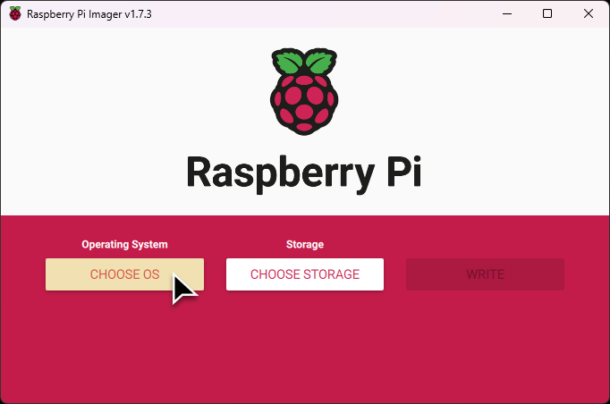{ align=center loading=lazy }
   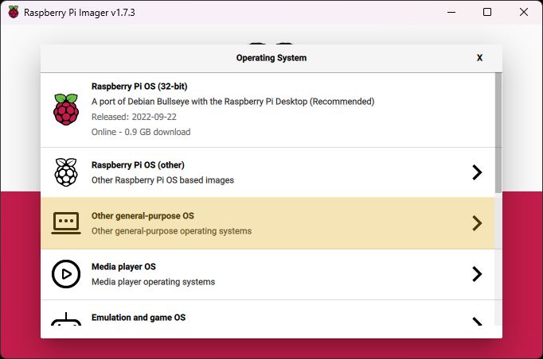{ align=center loading=lazy }

- Select "**Ubuntu**"

   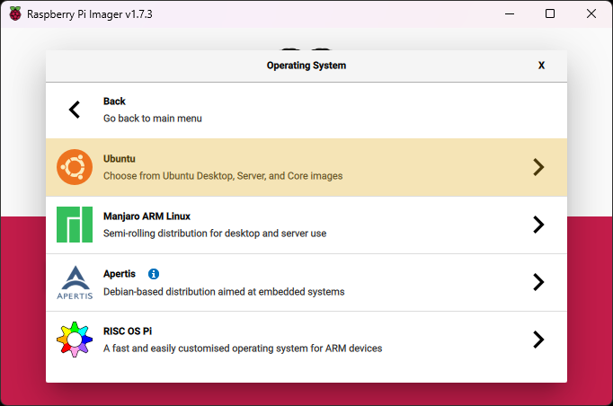{ align=center loading=lazy }

- Select "**Ubuntu Server 22.04.X LTS (64-bit)**"

   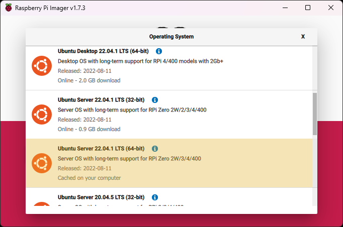{ align=center loading=lazy }

- Click "**CHOOSE STORAGE**" and select your SD Card/Hard Disk

   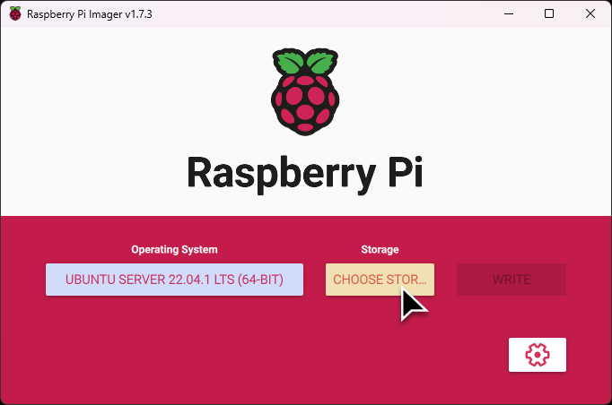{ align=center loading=lazy }
   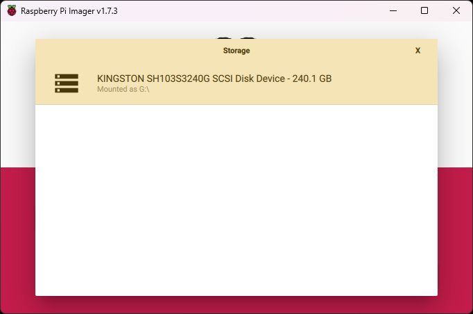{ align=center loading=lazy }

- Click on the :fontawesome-solid-gear: icon

   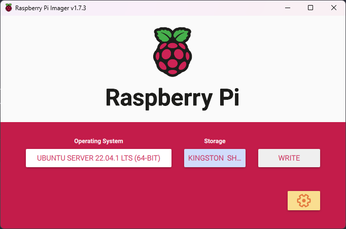{ align=center loading=lazy }

- Change the system's hostname

   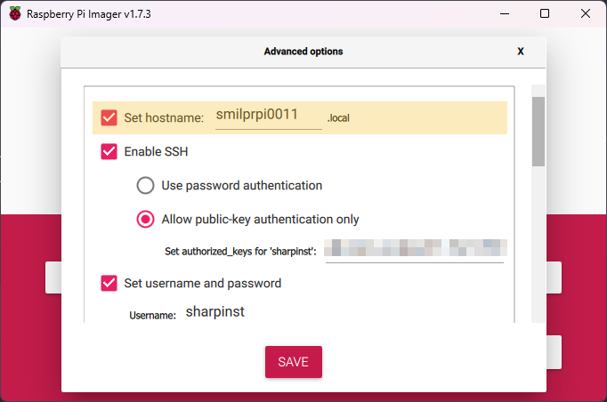{ align=center loading=lazy }

- Enable SSH and add your SSH public key

   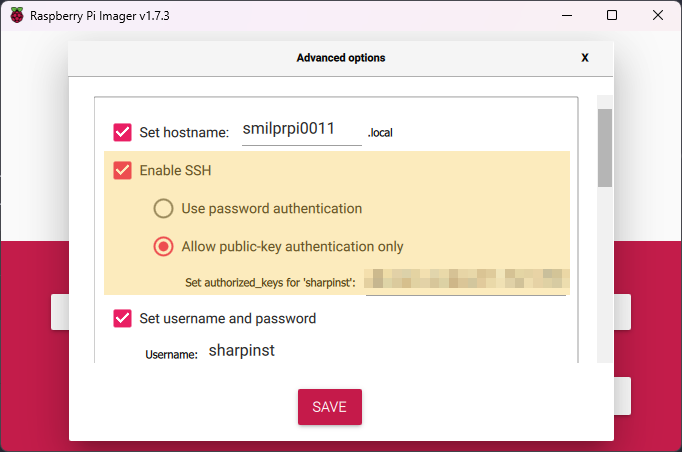{ align=center loading=lazy }

- Set the install user and it's password

   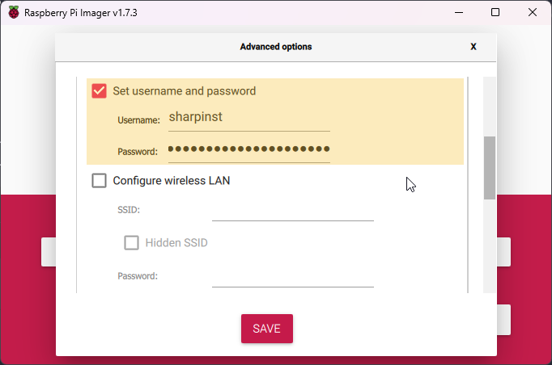{ align=center loading=lazy }

- Set the locales and "**Save**"

   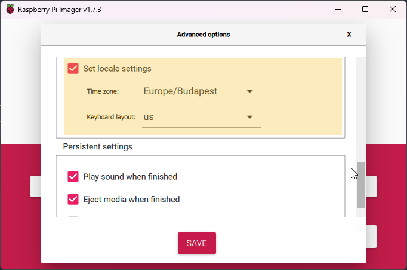{ align=center loading=lazy }

- Click on "**WRITE**"

   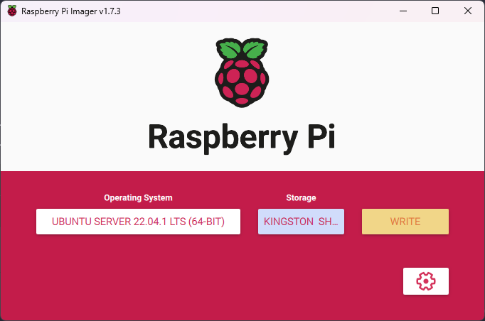{ align=center loading=lazy }

- Confirm the overwrite of **all data on the drive**

   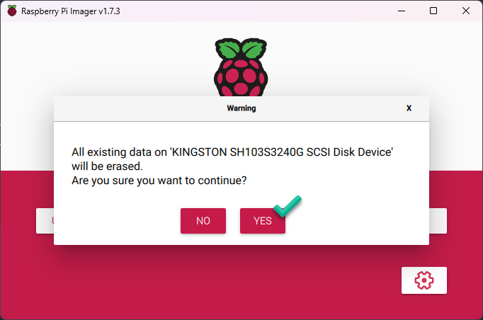{ align=center loading=lazy }

- Wait for the Write process to finish

   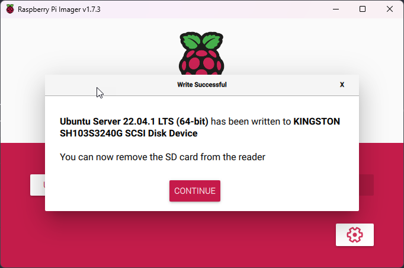{ align=center loading=lazy }

## First Boot

???+ info
    During the first boot it take some time for the system to apply all the settings we requested. Before we do anything else make sure the cloud-init finished the setup.

    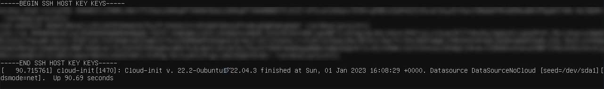{ align=center loading=lazy }

Once the system is booted up we have to run the **main** SharpNET Controller role against it. However, before we can do this first we have to make sure some settings are correct in the invetory.yml.

```yaml title="${controller}/inventory.yml" hl_lines="4 5"
    smilprpi0011.sharpnet.sdac:
      shncfg_baseline_install_user: "sharpinst"
      # Make sure these lines are not commented out
      sharpnet_cfg_connect_user: "{{ shncfg_baseline_install_user }}"
      sharpnet_cfg_become_password: "{{ smilprpi0011_become_password }}"
      # ansible_ssh_pass: "{{ smilprpi0011_become_password }}"
```

???+ info
    If you see an error message about the Host key make sure to delete the old host key with ssh-keygen, then add the new Host key by logging to the system via SSH.
    ```shell
    ssh-keygen -f ~/.ssh/known_hosts -R "smilprpi0011.sharpnet.sdac"
    ssh smilprpi0011.sharpnet.sdac
    ```

```shell
ansible-playbook -i inventory.yml --limit=smilprpi0011.sharpnet.sdac main.yml
```

<div id="rpi-fail-asciinema" style="z-index: 1; position: relative; max-width: 100%;"></div>

???+ info
    If the playbook fails with the bellow error message about reloading the `step-ca` service, make sure the `yubikey` is connected to the raspberry.
    ```shell
    Unable to start service step-ca: A dependency job for step-ca.service failed.
    ```

<div id="rpi-success-asciinema" style="z-index: 1; position: relative; max-width: 100%;"></div>

<script>
  window.onload = function(){
    AsciinemaPlayer.create('/sharpnet-docs/images/asciinema/rpi0011-fail.cast', document.getElementById('rpi-fail-asciinema'), {
        poster: 'npt:1:23',
        rows: 13
    });
    AsciinemaPlayer.create('/sharpnet-docs/images/asciinema/rpi0011-success.cast', document.getElementById('rpi-success-asciinema'), {
        poster: 'npt:1:23',
        rows: 13
    });
}
</script>